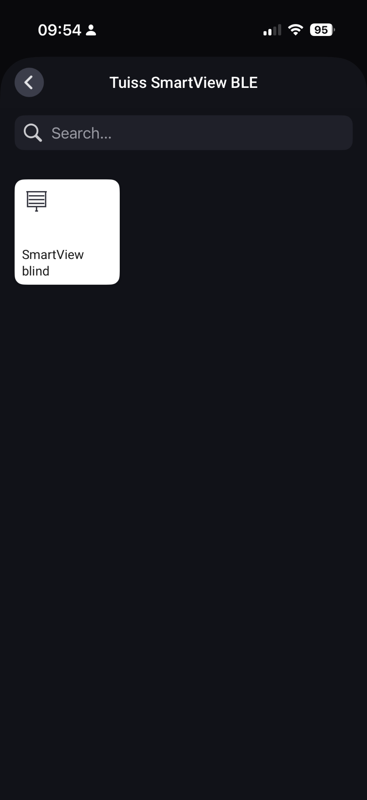
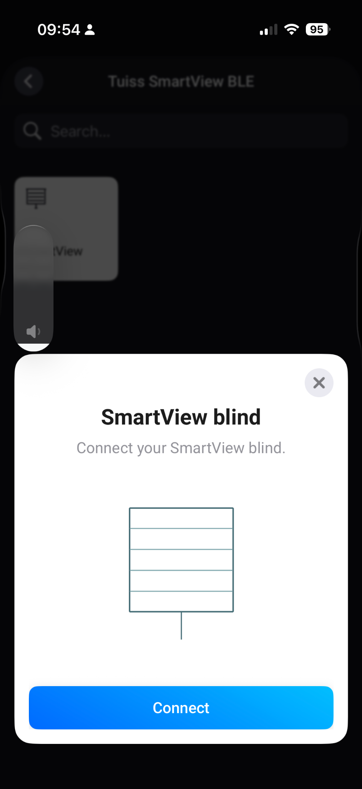
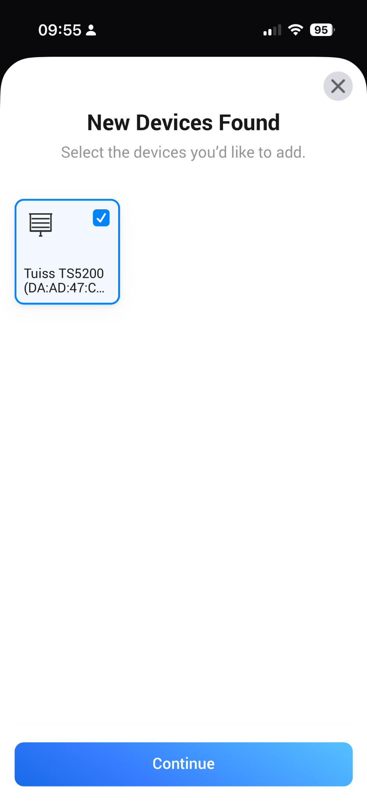
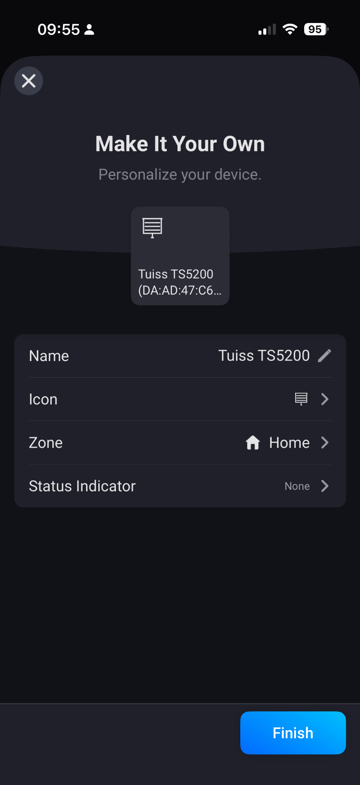
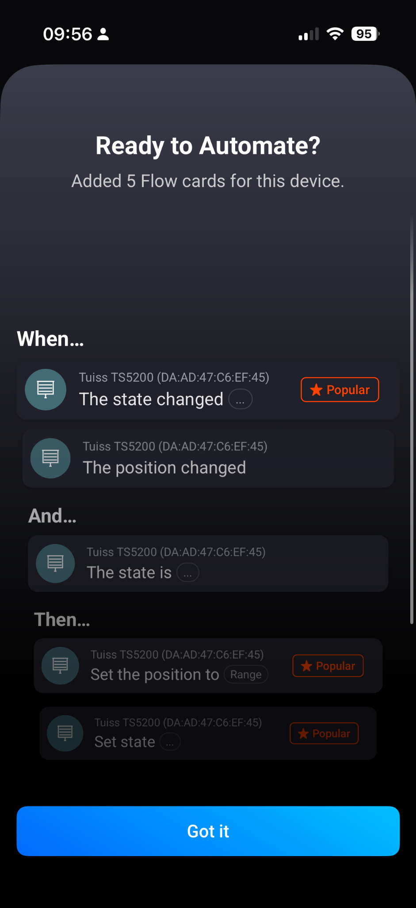
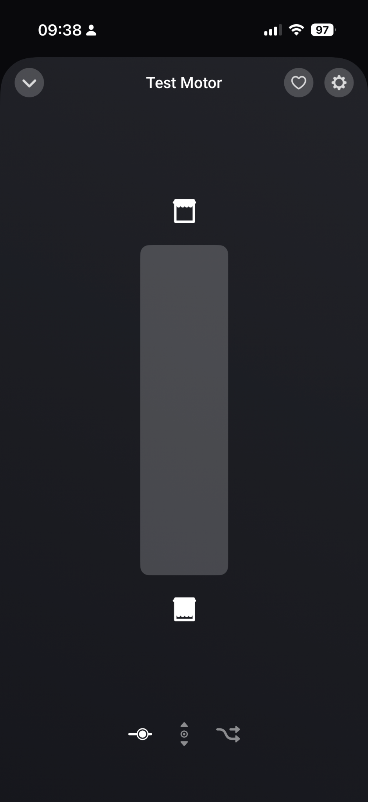
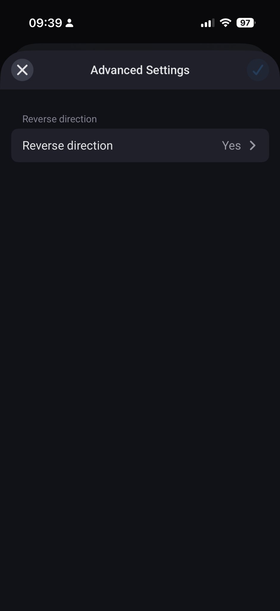
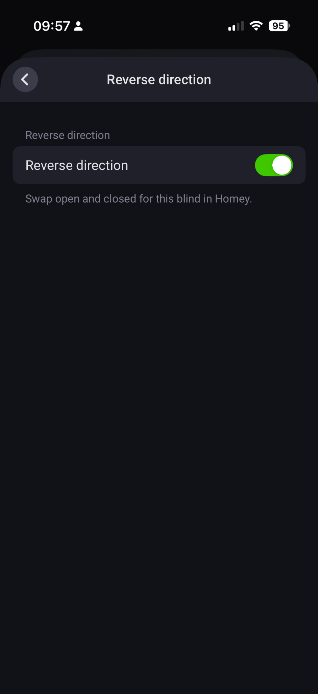

# Tuiss SmartView BLE for Homey Pro

Version **0.2.1**. An experimental Homey SDK v3 app that controls Tuiss SmartView blinds locally over Bluetooth Low Energy (BLE). It does not require a separate remote control.

The app recognizes these advertised device names from Tuiss2HA: TS3000, TS5200, TS5300, TS2600, TS2900, TS5001, and TS5101. MRM-G2 and MHC-G2 are also included as possible names, although the model printed on a motor does not necessarily match its BLE advertisement. If the scan finds no recognized names, the pairing screen lists other connectable BLE devices so you can identify your motor by its address. Only select a device you can positively identify as your motor. The motor must be within Bluetooth range of your Homey Pro.

## Install and pair

1. Make sure the motor already works in the Tuiss SmartView phone app. For the initial test, place the Homey Pro near the motor and close the phone app.
2. Extract the ZIP file on your computer. Install Node.js and the Homey CLI with `npm install -g homey`.
3. Open a terminal in the extracted `tuiss-homey` directory and run `npm install`.
4. Sign in to the Homey CLI with `homey login`. A browser window opens: sign in with the **same Homey account that owns or can access your Homey Pro** and authorize the CLI. If no browser opens, copy the URL shown in the terminal into your browser. You do not need to enter your Homey password in the terminal.
5. Run `homey select` and choose your Homey Pro from the list. If you have several Homeys, check your choice with `homey select current`. Your CLI sign-in and selected Homey are remembered for later updates; you normally only need to repeat these steps if you change accounts or Homeys.
6. Run `npx homey app install` **from the `tuiss-homey` directory** to install the app on the selected Homey. Do not use `--clean` when updating an existing installation.
7. In the Homey app, select **Add device → Tuiss SmartView BLE → SmartView blind**, then select your motor. Follow the illustrated pairing guide below.
8. Test fully open and fully closed, then a middle position and Stop. If open and closed are reversed compared with the phone app, open the motor's **Advanced settings** in Homey and enable **Reverse direction**. This also works for an already paired motor.

## Pairing guide

The screenshots show a **Tuiss TS5200**. Other motors may advertise a different name or use a different pairing procedure. Keep your Homey Pro within Bluetooth range, and close the Tuiss phone app before pairing.

1. In Homey, add a Tuiss SmartView BLE device and choose **SmartView blind**.

   

2. Tap **Connect**. Press and hold the button on the blind's motor for about **four seconds**. The blind moves briefly to acknowledge the button press and becomes discoverable for a short time. If the scan misses it, repeat this step.

   

3. Select the motor that Homey finds and tap **Continue**. This example appears as **Tuiss TS5200**; confirm it is your own motor before continuing.

   

4. Choose a name and zone, then tap **Finish**.

   

5. Homey shows the available Flow cards after pairing. Tap **Got it** to finish.

   

## Controls and direction

Open the paired device in Homey to move the blind and set a position. The screen below shows the device controls.

If Homey opens the blind when the Tuiss phone app closes it, open the device's **Advanced settings** and select **Reverse direction**. Enable the switch and save the setting. This swaps open and closed as well as the displayed position; it does not change the motor's hardware calibration.

These screenshots are part of this source package and illustrate the mobile app; Homey's App Store `README.txt` is plain text and will not display embedded images.

## Set motor end limits (experimental)

Version 0.2.1 adds calibration buttons under the paired blind's **Settings → Maintenance actions** (Dutch: **Instellingen → Onderhoudsacties**). Existing devices gain these buttons automatically after updating the app; do not remove and pair the motor again.

1. Close the Tuiss phone app, pause Flows controlling this blind and stay near the blind. Keep the movement path clear. Starting setup replaces both hardware endpoints; it does not just change Homey's percentage display.
2. Tap **Set limits** and confirm the action. This starts setup directly from the settings; it does not open a separate screen. Wait until **Save limit** changes to **Save lower limit** or **Save upper limit**. The description of **Set limits** shows connection progress and the current step.
3. Use **Step up** and **Step down** to reach the first endpoint. Tap the named **Save … limit** button once, then wait for its name to change to the other endpoint.
4. Move to the second endpoint using the step buttons. Save that endpoint too. The **Set limits** description then reports that both commands were sent, and the save button returns to **Save limit**.
5. Check open, closed and a middle position while watching the blind.

With Reverse direction disabled, the order is lower/closed first, then upper/open. With Reverse direction enabled, the displayed order and jog buttons are reversed to match Homey's controls; the motor still receives its native lower-then-upper sequence. This feature uses small jog steps, rather than continuous travel. If Homey has not refreshed a button label after an operation, reopen the device settings before saving the next endpoint.

The Bluetooth connection remains open during setup. Normal Homey control commands cannot move the motor during this session. **Stop setup**, a connection loss or three minutes without a command ends setup. Stop setup can also cancel while connecting. Closing the device settings alone does **not** end a maintenance-button session: finish both endpoints or press Stop setup.

Interrupted configuration cannot restore the previous limits: set **both** endpoints again through Set limits or the Tuiss app. A Homey warning remains after interrupted calibration; completing a new Homey calibration clears it. If you complete calibration in the phone app, Homey cannot detect that automatically. Maintenance buttons acknowledge requests immediately to avoid a ten-second timeout; wait for the current operation to finish before pressing another step/save button. A final failure appears in the device warning and the Set limits description.

The previous guided wizard remains available through **Settings → Repair → Set limits** (Dutch: **Instellingen → Repareren → Set limits**) as an alternative. Use one method for the whole session: maintenance buttons cannot take over a session started through Repair, and vice versa. Closing the Repair wizard ends its session.

The implementation follows Tuiss2HA's limit-setting protocol. Software tests cover the calibration command order, device upgrades, maintenance controls, connection ownership, direction reversal and interruption handling. **Calibration and the maintenance UI have not yet been tested on a physical Homey/motor.** Successful writes mean the commands were sent; verify the actual endpoints yourself. Existing pairing/control screenshots show an older version and do not show the new calibration controls.

## Connection behavior and limitations

Version 0.2.1 retains the reconnection behavior tested with the TS5200 in version 0.1.5. The app releases the BLE connection after a command, normally after eight seconds or three seconds after receiving the target position. It also cleans up a connection dropped by the motor and scans again for the next command. The **Reverse direction** setting reverses commands, incoming position updates, and the position already shown in Homey.

Homey acknowledges a control request immediately because discovering and connecting over BLE can take more than ten seconds. The command continues in the background, in order. If connecting or writing ultimately fails after retries, a warning appears on the device in Homey; a later successful command clears a normal connection warning. An incomplete limit setup warning remains until both endpoints are configured through Homey. A successful BLE write does not prove that the blind has finished moving.

Position changes made in the Tuiss phone app are not automatically reflected in Homey. Bluetooth range, characteristics, notifications, and pairing may vary by motor. Homey Bridge as a BLE satellite has not been tested.

To update an existing installation, run `npx homey app install` from the extracted `tuiss-homey` directory; do not use `--clean`. For live BLE logs, temporarily run `npx homey app run --remote` and issue a command in Homey. After stopping the debug run, reinstall the app with `npx homey app install`.

## Attribution and license

Protocol commands and supported model names are adapted from [pink88/Tuiss2HA](https://github.com/pink88/Tuiss2HA), licensed under GNU GPL v3. This derivative app is licensed under GPL-3.0-only. See `LICENSE` and the Tuiss2HA source for attribution. This is not an official Tuiss or Homey app.
